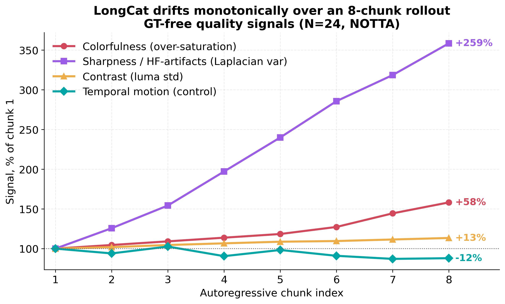
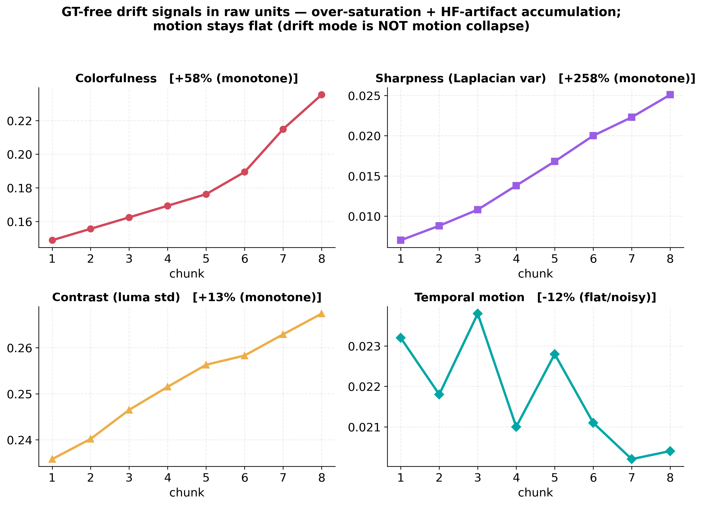
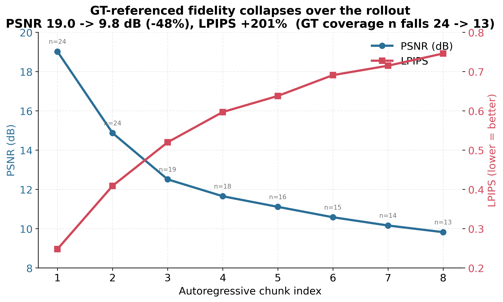
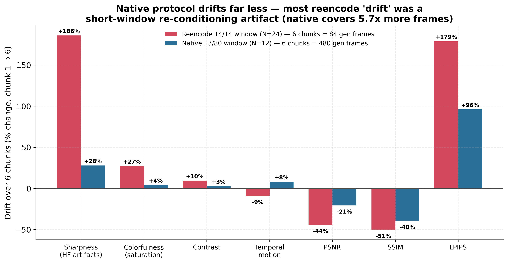
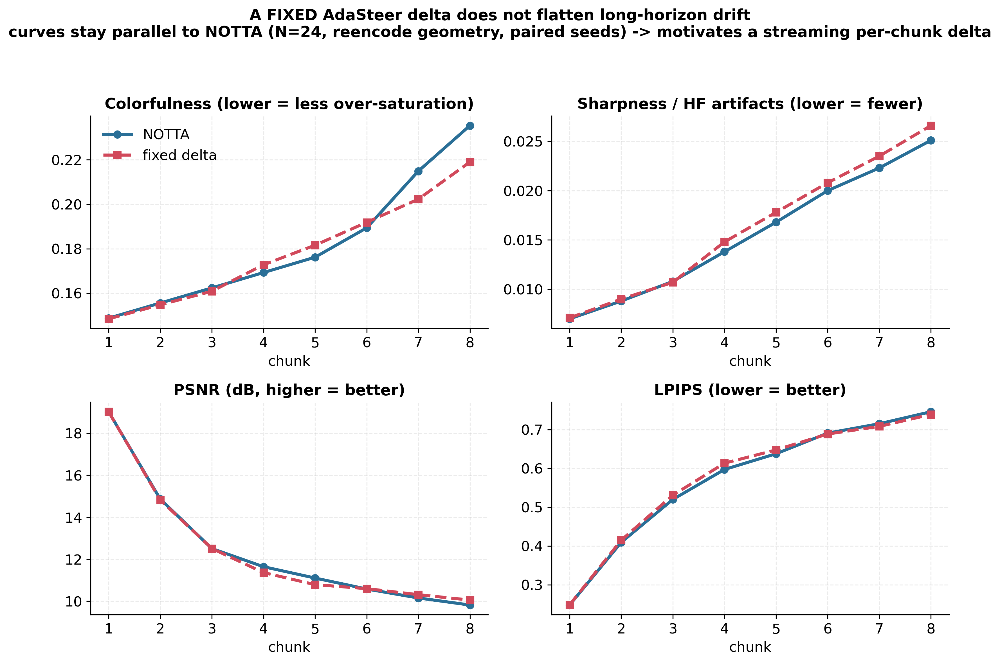

# Presentation deck — narrative start: "LongCat drifts under long-horizon rollout"

**Purpose:** This is the OPENING NARRATIVE for the next presentation deck. It is
organized slide-by-slide. All numbers are from the completed drift run
(`diag_longhorizon_drift.py`, SLURM job **15497180**, NOTTA, N=24 videos × 8
chunks, reencode geometry cond=14 / frames=28 / gen_start=48, 50 steps, CFG=4.0,
seed=42). Figures live in `../paper_figures/2026-08-08_longhorizon_drift/` and are
regenerable via `scripts/make_drift_presentation_figs.py`. Full data + verdict
table: `../paper_tables/2026-08-08_longhorizon_drift_presentation.md`.

**Status (2026-08-09 update — READ FIRST):** the story is now *apparent → controlled
→ real headroom that COMPOUNDS with horizon*. (1) The dramatic reencode drift is
largely a short-window measurement artifact — natively the model is far more robust
(Slide 5b). (2) BUT when we push the native rollout to a **genuinely long horizon
(~60s, 12 chunks = 960 gen frames, ~50% of the field's 2-min ceiling)**, the GT-free
drift **compounds**: sharpness +48% (vs +28% at 30s), temporal_motion +45% (vs +8%),
contrast −16% (vs +3%) — Slide 5c. So the "moderate" 30s read *understated* it; drift
grows with length. (3) A fixed AdaSteer delta does not flatten it (Slide 7) →
motivates the streaming per-chunk delta (**EXP4, launched 2026-08-09**, jobs
15551946–49, paired seeds vs the 60s NOTTA run). Present drift as *apparent →
controlled → real, horizon-compounding headroom → our streaming fix*. Both native
runs are gating N (N=8–12); widen N once EXP4 shows signal.

---

## Slide 1 — The hook

**"On the easy task, nothing we do matters. So we made the task hard — and the
model breaks in a way we can fix."**

- Every intervention we tried (AdaSteer delta, placement ablation, TANGO
  gaussianity guidance) was ~null on our short, in-domain, single-chunk 14→14
  continuation.
- Diagnosis (2026-08-06 problem-difficulty audit): LongCat-Video (13.6B, RLHF,
  continuation-pretrained) is *too strong* for that framing — headroom is small
  **by construction**, not because TTA can't help.
- The field finds its headroom in **long-horizon autoregressive rollout**, where
  error compounds chunk-over-chunk. So we tested that regime.

---

## Slide 2 — What we did (setup)

- Identical per-chunk geometry to all our prior runs; we simply **feed the
  model's own generated tail back** as the next chunk's conditioning and repeat
  for **8 chunks**. Nothing is trained — this is the **NOTTA baseline**.
- We measure quality per chunk with two families:
  - **GT-free (path-independent)** signals, defined for the *entire* rollout even
    after the source clip's ground truth runs out: sharpness (Laplacian
    variance), colorfulness (Hasler–Süsstrunk), contrast, temporal motion.
  - **GT-referenced** metrics (PSNR / SSIM / LPIPS) where the source clip still
    overlaps the rollout.

---

## Slide 3 — Headline result

**LongCat degrades strongly and MONOTONICALLY over the rollout.**

- Short-horizon saturation does **not** survive chaining.
- Over-saturation: colorfulness **+58%**. HF-artifact accumulation: sharpness
  **+258%**. Contrast **+13%**. All monotone.
- ⚠️ **Present these as *apparent* drift.** The control (Slide 5b) shows most of
  this magnitude is our short-window eval protocol, not the model. Build the
  suspense: show the alarming curve, then reveal the control.

---

## Slide 4 — The drift mode is specific (not generic collapse)

- Temporal motion is **flat/noisy (−12%, non-monotone)** → the failure is **NOT
  motion collapse** (this distinguishes us from motion-drift papers).
- The mode is **progressive over-saturation + rising high-frequency (non-white)
  residual** — precisely the signature a whiteness/spectral steering term or a
  re-anchoring correction is designed to flatten.

---

## Slide 5 — GT-referenced fidelity collapses too

- PSNR **19.0 → 9.8 dB (−48%, −1.12 dB/chunk)**, SSIM 0.71 → 0.31, LPIPS
  **+201%** — front-loaded (PSNR already 12.5 dB by chunk 3).
- Caveat we state up front: lead with the GT-free signals, because PSNR partly
  reflects *legitimate* divergence from a single GT path (continuation is
  multimodal), and GT coverage shrinks (n = 24 → 13) as the clip runs out.

---

## Slide 5b — CONTROL (the pivot): most of that "drift" was our measurement protocol

**The honest reveal.** We re-ran NOTTA under LongCat's **native** window
(13-cond / 80-gen, its idiomatic long-gen geometry) instead of our short 14/14
window. `generate_vc` has no KV-cache carryover across windows, so native
long-horizon *is* this same external tail-chaining — the only thing that changed
is the **geometry**. Result: drift shrinks dramatically, **even though 6 native
chunks cover 480 generated frames vs 84 for reencode (5.7× longer horizon)**.

| Signal (chunk 1 → 6) | Reencode 14/14 (N=24) | Native 13/80 (N=12) |
|---|--:|--:|
| Sharpness / HF artifacts | +186% | **+28%** |
| Colorfulness (saturation) | +27% | **+4%** |
| Contrast | +10% | +3% |
| Temporal motion | −9% | +8% |
| PSNR | −44% | **−21%** |
| SSIM | −51% | −40% |
| LPIPS | +179% | **+96%** |

- **Take:** the over-saturation and HF-artifact "explosion" were **short-window
  re-conditioning artifacts** (frequent re-anchoring, 14-frame windows, pixel
  re-encode). Under the native protocol LongCat is much more robust.
- **But headroom is not zero:** natively, over a long rollout LongCat still loses
  real perceptual fidelity — **LPIPS ~2× (+96%), SSIM −40%, PSNR −21%, sharpness
  +28%**. The real target is *perceptual-fidelity decay*, not saturation.
- **Caveat (state it):** native is **preliminary N=12** (arm hit the 12 h wall at
  12/16 videos), 6 chunks, different video subset — directional, not paired.
  Finishing to N=16 + a matched-horizon (x = generated-frame count) comparison is
  the open confirm.

---

## Slide 5c — Push to ~1 minute: native drift COMPOUNDS with horizon

**The re-elevation.** The native control above ran only 6 chunks (~30 s, 480 gen
frames) — the *low end* of "long-horizon." Reviewers of long-horizon continuation
expect 30 s–2 min+ (StreamingT2V ~2 min/1200 f; Rolling Forcing multi-minute;
LongCat's own design point ~1 min). So we extended the native rollout to **12
chunks = 960 generated frames ≈ 60 s @16 fps** (~50 % of the 2-min field ceiling),
sharded across 4 jobs, N=8, seed=42, native 13-cond/80-gen.

| GT-free signal (chunk 1 → last) | Native 30 s (6 ch, N=12) | **Native 60 s (12 ch, N=8)** | reading |
|---|--:|--:|---|
| Sharpness / HF artifacts | +28% | **+48%** | artifacts accumulate faster the longer you roll |
| Temporal motion | +8% | **+45%** | spurious motion / instability injected over time |
| Contrast | +3% | **−16%** | a fade sets in only at long horizon |
| Colorfulness (saturation) | +4% | +5.7% | still mild — NOT the driver |

- **Take:** the 30 s "moderate" picture *understated* the problem. At a genuinely
  long horizon the GT-free drift **grows monotonically with rollout length** — this
  is the decisive headroom that was absent at short/6-chunk geometry, and it exists
  under the corrected native protocol (not just the inflated reencode one).
- **Refines Slide 4:** motion isn't *collapsing* — at long horizon it **inflates
  (+45 %)**, i.e. the rollout injects unstable/spurious motion. The drift mode is
  *HF-artifact accumulation + motion instability + contrast fade*.
- **Caveats (state them):** N=8 is a **gating** sample, not a paper number.
  PSNR/SSIM/LPIPS are **not** the long-horizon signal here — GT overlap runs out
  after ~1–2 chunks (short source clips), so their "chunk1→last" spans a tiny window
  (that's why the reported PSNR slope is a steep −2.56/chunk over 2 points). Judge
  long-horizon drift by the **GT-free** curves only.

---

## Slide 6 — Data appendix (per-chunk, mean over N=24)

| Chunk | Sharpness | Motion | Colorfulness | Contrast | PSNR | SSIM | LPIPS | GT n |
|------:|----------:|-------:|-------------:|---------:|-----:|-----:|------:|-----:|
| 1 | 0.0070 | 0.0232 | 0.1488 | 0.2358 | 19.02 | 0.710 | 0.248 | 24 |
| 2 | 0.0088 | 0.0218 | 0.1556 | 0.2402 | 14.87 | 0.587 | 0.409 | 24 |
| 3 | 0.0108 | 0.0238 | 0.1624 | 0.2465 | 12.51 | 0.505 | 0.520 | 19 |
| 4 | 0.0138 | 0.0210 | 0.1693 | 0.2515 | 11.65 | 0.432 | 0.597 | 18 |
| 5 | 0.0168 | 0.0228 | 0.1762 | 0.2563 | 11.11 | 0.390 | 0.638 | 16 |
| 6 | 0.0200 | 0.0211 | 0.1894 | 0.2583 | 10.58 | 0.351 | 0.691 | 15 |
| 7 | 0.0223 | 0.0202 | 0.2149 | 0.2629 | 10.16 | 0.321 | 0.715 | 14 |
| 8 | 0.0251 | 0.0204 | 0.2354 | 0.2674 |  9.82 | 0.311 | 0.746 | 13 |

**Verdict (chunk 1 → 8):** sharpness +258%, colorfulness +58%, contrast +13%
(all monotone); motion −12% (flat); PSNR −48%, SSIM −56%, LPIPS +201%.

---

## Slide 7 — Follow-through control #1: a FIXED delta does NOT flatten the drift

**Result (EXP-B, `delta_reencode`, N=24, reencode geometry, paired seeds vs
NOTTA; mean `delta_norm`=0.139 so the delta really trained):** holding a single
AdaSteer delta (trained once on the chunk-0 context) fixed across the rollout
leaves the curves **essentially parallel to NOTTA** — the degradation slope is
unchanged.

| Signal (chunk 1 → 8) | NOTTA | Fixed delta | Read |
|---|--:|--:|---|
| Sharpness / HF artifacts | +258% | +276% | slightly **worse** (adds HF) |
| Colorfulness (saturation) | +58.2% | +47.5% | marginally better |
| Contrast | +13.4% | +12.5% | tied |
| Temporal motion | −12.0% | +4.4% | marginally better |
| PSNR | −48.4% (→9.82) | −47.1% (→10.06) | +0.24 dB late (noise) |
| LPIPS | +200.9% | +197.5% | tied |

- **Takeaway:** a context-0 delta goes **stale** as the rollout leaves the trained
  distribution — exactly the predicted failure. This is a clean motivation slide,
  not a loss: it sets up the fix.
- **Caveat:** this was measured at the *reencode* (inflated-drift) geometry, so it
  must be re-run at native geometry against the milder real target. The null is
  informative either way — a fixed delta is the wrong tool for a moving target.

---

## Slide 8 — What's next

- **EXP4 streaming delta — LAUNCHED (2026-08-09, jobs 15551946–49):** re-fit the
  steering vector **per chunk** on the most recent generated window, re-anchored
  toward the real-data chunk-0 delta (`--stream-blend 0.5`) so it tracks the moving
  distribution without chasing its own artifacts. Runs at the **same native 60 s
  geometry + seed** as the NOTTA run, so it's **paired** per-video. This is the
  direct answer to the fixed-delta null (Slide 7).
  - **Read when it lands:** do the GT-free curves (sharpness, temporal_motion,
    contrast) **flatten** vs the NOTTA verdict? If the delta *amplifies* the rising
    sharpness/motion, escalate the anchor (λ → 0.6–0.7).
- **Horizon length is itself a lever (Slide 5c):** drift compounds with rollout
  length, so the gap an intervention can open should **widen** at longer horizons —
  strengthens the case for evaluating natively at ≥1 min, not at 30 s.
- **Widen N + matched-horizon:** native runs are gating N (8–12). Once EXP4 shows
  signal, scale N and add the matched-horizon (x = cumulative generated frames)
  native-vs-reencode plot to lock Slide 5b.
- **TANGO++ (re-weighted UP slightly):** HF-artifact accumulation is now the
  *leading* native drift mode at 60 s (sharpness +48 %), so a whiteness/spectral
  term regains motivation — keep as a secondary lever behind the streaming delta.
- **Honest ask of the deck:** lead with the *methodological* contribution — "naïve
  short-window rollout eval massively overstates drift; here's the corrected native
  measurement" — then reveal that at a genuinely long horizon **real drift
  compounds**, and present our streaming-delta fix (running now) to address it.
