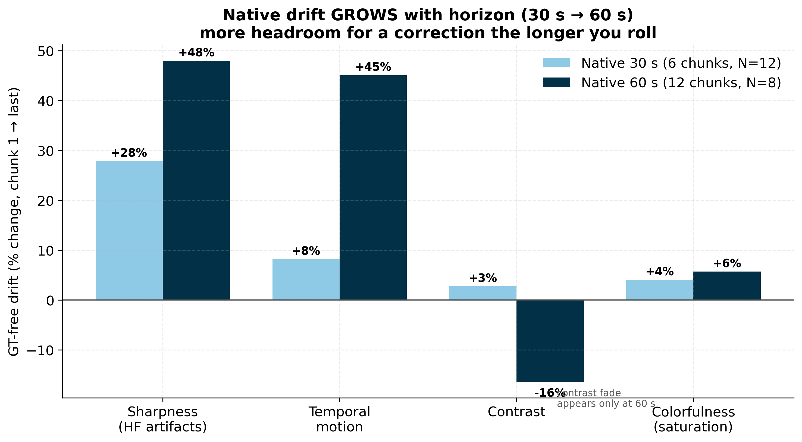
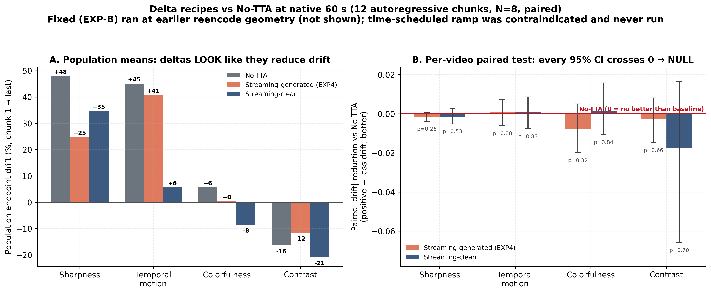

# Presentation deck — "From measuring drift to a drift-gated test-time controller"

**Purpose:** This is the CURRENT full presentation narrative, slide-by-slide. It
supersedes `2026-08-08_deck_narrative_longhorizon_drift.md` (kept for audit trail)
by folding in that deck's measurement + negative-results content AND reframing it
around the **switch**: from parameter-space AdaSteer deltas (null) to a
**sampling-space, training-free, drift-gated GT-free test-time controller** with
two actuators (best-of-N search + anchored TTC correction).

**The one-sentence switch:** *We stopped trying to fix drift by nudging the
model's parameters (it can't — drift is exposure bias, an input-distribution
problem) and started fixing it in sampling space at test time, only on the chunks
that have actually drifted.*

**Provenance of numbers:**
- Drift measurement (Slides 1–6): `diag_longhorizon_drift.py`, NOTTA, reencode
  job **15497180** (N=24×8ch) and native runs (30 s N=12 / 60 s N=8, seed=42,
  50 steps, CFG=4.0). Figures: `../paper_figures/2026-08-08_longhorizon_drift/`.
- Negative catalogue (Slides 7–9): EXP-B fixed delta, EXP4 streaming delta,
  clean-anchored re-fit, routing/ramp gates — all logged in `../ANALYSIS_LOG.md`
  (2026-08-08 … 2026-08-10) and `../experiment_outputs/2026-08-{08,09,10}.md`.
- The switch + method (Slides 10–14): built 2026-08-10, commit `aa357e5`.
  best-of-N search sweep in flight (SLURM **15599852–15599859**, k=4 native 12ch
  N=8); anchored TTC actuator (`--method ttc|ttc_gated`) built + syntax-checked.

**Status (2026-08-10):** measurement is solid; the parameter-space intervention
line is a *closed, well-controlled negative*; the positive method is **built and
launched**, results pending. The deck is honest about what is proven (problem +
why the naive fix fails) vs. in-flight (does the controller beat NOTTA per-video).

---

# ACT I — THE PROBLEM IS REAL (measurement)

## Slide 1 — The hook

**"On the easy task, nothing we do matters. So we made the task hard — and the
model breaks in a way sampling-space correction is designed to fix."**

- Every intervention we tried on the short, in-domain, single-chunk 14→14
  continuation (AdaSteer delta, placement ablation, TANGO guidance) was ~null.
- Diagnosis (2026-08-06 problem-difficulty audit): LongCat-Video (13.6B, RLHF,
  continuation-pretrained) is *too strong* for that framing — headroom is small
  **by construction**, not because test-time adaptation can't help.
- The field finds its headroom in **long-horizon autoregressive rollout**, where
  error compounds chunk-over-chunk. So we moved there.

---

## Slide 1a — Evidence for claim #1: every short-horizon intervention was null

**In-domain Panda, single-chunk continuation. "Δ vs NOTTA" — positive = better
(except LPIPS/FVD where lower is better). Verdicts from the cited tables.**

| Intervention | What it does | N | Key result vs NOTTA | Verdict |
|---|---|--:|---|---|
| **AdaSteer δ** (global AdaLN bias) | one learned bias on the timestep/AdaLN embedding, broadcast to every block | **999** | PSNR 17.93→17.94; FVD 154.7→153.4; all 7 VBench dims flat | **null** (matches NOTTA on every metric) |
| **Placement ablation** (δ on AdaLN vs mid-late residual stream) | move the δ to the "concept-rich" band | **500** | PSNR **−0.26 dB** (both arms); FVD **+9.9 / +12.7** (worse); 7 VBench flat | **null** (NOTTA best on every fidelity/dist metric; the N=80 p=.013 edge washed out at N=500) |
| **TinyLoRA** (TL_BARE_R2 / TL_TIED_R2) | rank-2 test-time LoRA | **999** | PSNR/SSIM/LPIPS/FVD all ≈ NOTTA | **null** |
| **LoRA-R8 TTA** | rank-8 test-time LoRA | **999** | Aes **+0.047**, Dyn +0.031, but IQ **−0.034**, Subj −0.005; PSNR/FVD ≈ NOTTA | **trade, not a win** (moves along the quality frontier) |
| **Batch retrieval** (K5/K10 × SIM/RAND) | retrieve neighbours as extra context | **932** | all variants indistinguishable (SIM≈RAND) | **inconclusive** (UCF class-block artifact; Panda retrieval never run) |
| **Binary TTA/no-TTA gate + initial-loss router** | route per-video whether to adapt | **900** | always-fixed **−0.003 dB [−0.025, +0.019]**; perfect-gate headroom **+0.069 dB = the noise floor**; probe AUC ≈ 0.50 | **ruled out** (oracle only recovers max-over-noise; probe at chance) |
| **TANGO EXP3** (predicted-noise gaussianity guidance) | distribution-level sampling guidance for FVD | **80** | pixel metrics NaN (eval bug, pending); FVD 534–557 across λ, no confirmed win | **inconclusive / weak** |

- **Read:** on the easy task, no lever — parameter-space (δ, LoRA), data-space
  (retrieval), routing, or sampling-guidance (TANGO) — beats NOTTA at reliable N.
- **The routing row is the key tell:** even a *perfect* per-video oracle gains only
  **+0.069 dB, exactly the E|g|/2 noise floor** → the apparent per-video headroom is
  manufactured by maxing over noise, not signal.
- *(Sources: `paper_tables/2026-06-08_headline_1000v.md` (N=999, `build_paper_tables.py`);
  `2026-08-06_placement_allmetric_matchedN.md` (job 15445271, N=500);
  `2026-08-04_binary_gate_initial_loss_1000v.md` (N=900);
  `experiment_outputs/2026-08-07.md` (TANGO jobs 15444775–77, N=80). Long-horizon
  delta axes are a separate null family — Slide 4.)*

---

## Slide 1b — Evidence for claim #2: the task was too easy (problem-difficulty audit, 2026-08-06)

**What we did:** tabulated base model + frame geometry + eval for the field vs. ours.

| | Base model | Task geometry | Eval |
|---|---|---|---|
| **The field** | Wan2.1-**1.3B**, CogVideoX-5B, distilled AR DiTs | **long-horizon rollout 30 s–minutes**, OOD / high-motion, 49–81+ frames | per-chunk drift, cross-chunk seams |
| **Ours (then)** | **LongCat-Video 13.6B, RLHF, continuation-pretrained** | **single 14→14 chunk (~0.5–1 s), in-domain Panda** | one short clip, video-level mean |

- **Two independent reasons it saturates:** (a) we picked the model *built* to make
  continuation trivial — LongCat's headline is *"minutes-long video without color
  drift or quality degradation"* — and gave it the **easiest slice of its home
  task**; (b) we removed every difficulty knob the field's headroom comes from
  (length, OOD, weaker model, localized metrics).   **STAS** (Structured Activation
  Steering; Cheng et al., "Steering Video Diffusion Transformers with Massive
  Activations," arXiv:2603.17825, 2026 — a training-free activation-steer
  of first-frame/boundary tokens) steers a **1.3B** model and still gets only
  **+0.37 VBench** (81.39→81.76, a self-described "near-ceiling regime"); on a
  saturated 13.6B RLHF model, expect less. STAS also reports its gains **concentrate
  at cross-chunk (latent-boundary) transitions and dilute under video-level
  averaging** — the exact reporting trap our per-video means fell into, and why our
  GT-free suite includes a seam-continuity signal.
- **The bug we caught in the audit:** our "long-context" path generated all 79 gen
  frames in a **single diffusion call** — *not* autoregressive chaining. So the
  cross-chunk exposure-bias accumulation the whole long-video literature studies
  **never occurred in our pipeline**. Every prior "null" was measured where there
  was nothing to fix.
- **Outcome / decision:** relocate to **true autoregressive rollout** and let the
  data decide — degradation ⇒ headroom found; none ⇒ switch base model.
- *(Source: `paper_tables/2026-08-06_problem_difficulty_field_geometry.md`.)*

---

## Slide 1c — Evidence for claim #3: the headroom is real (long-horizon drift, concrete)

**We ran that decisive diagnostic** (`diag_longhorizon_drift.py`): feed LongCat its
own generated tail back and roll out. The headroom that was **absent** at short
horizon (Slide 1a) **appears and compounds** natively:



| GT-free signal (chunk 1 → last) | Short (1 chunk) | Native 30 s (6 ch) | **Native 60 s (12 ch)** |
|---|--:|--:|--:|
| Sharpness / HF artifacts | ~0 | +28% | **+48%** |
| Temporal motion | ~0 | +8% | **+45%** |
| Contrast | ~0 | +3% | **−16%** |
| Perceptual (LPIPS, GT window)† | ~0 | **+96%** | −5% (GT-limited)† |

† LPIPS/PSNR/SSIM need frame-aligned ground truth, which **runs out after ~1–2
native chunks** (source clips are short). Both native LPIPS cells therefore
measure only that early GT window, *not* the full rollout. The 60 s value
(0.303→0.289, N=8) spans an even tinier window than the 30 s value (N=12), so it
is a **gating sample, not a long-horizon signal** — do not read it as "fidelity
improves at 60 s." Judge long-horizon drift by the GT-free rows above.

- **Concrete headroom:** from *no measurable degradation* on one chunk to
  **sharpness +48%, motion +45%, contrast −16%** over a 60 s native rollout (plus
  **LPIPS ~2×** over the early GT window at 30 s) — and the GT-free drift **grows
  monotonically with length**, so a correction has *more* room the longer you roll.
- This is the pivot point: Slide 1a proves there's nothing to fix short-horizon;
  this proves there *is* long-horizon. Full drift detail + the reencode-vs-native
  measurement correction are on Slides 2b–3.
- *(Source: `longhorizon_sweep_notta_native_{6,12}ch` (2026-08-09); figure
  regenerable via `scripts/make_drift_horizon_growth_fig.py`.)*

---

## Slide 2 — Setup: chained rollout, two metric families

- Identical per-chunk geometry to all prior runs; we **feed the model's own
  generated tail back** as the next chunk's conditioning and repeat. Nothing is
  trained — this is the **NOTTA baseline**.
- Quality per chunk, two families:
  - **GT-free (path-independent):** sharpness (Laplacian var), colorfulness
    (Hasler–Süsstrunk), contrast, temporal motion — defined for the *entire*
    rollout, even after the source clip's ground truth runs out.
  - **GT-referenced:** PSNR / SSIM / LPIPS, where the source clip still overlaps.
- **Why this matters later:** the GT-free family is exactly the signal our
  controller uses as   a **verifier and a gate** — it needs no ground truth, so it
  is *deployable* at inference.

---

## Slide 2b — Which metrics even work at long horizon (and why VBench++ is the *right* eval, not an impossible one)

**Three metric families, three fates as the rollout gets long:**

| Family | Examples | Needs | Fate at long horizon |
|---|---|---|---|
| **Pixel / GT-referenced** | PSNR, SSIM, LPIPS | frame-aligned **ground truth** | **Breaks.** The source clip runs out after ~1–2 native chunks, so coverage collapses (n→small, spans a tiny window). Also, continuation is legitimately *multimodal* — divergence from one GT path ≠ failure. |
| **Distribution-level** | FVD, FID | a **reference set** of many clips | Population-level only; content-biased (Ge et al. CVPR'24, `ge2024contentdebiasedFVD`). Good for a final headline, **no per-chunk drift curve**. |
| **GT-free per-video** | (a) our hand-crafted signals; (b) **VBench++** dims | **nothing but the generated video** | **Works at any length.** This is the only family that gives a per-chunk drift curve on the full rollout. |

**Key point (state this to the audience):** it is **NOT** that VBench++ can't
score long videos — the opposite. VBench++'s continuation-relevant dimensions are
**all GT-free** and run on generated video alone: **subject/background consistency,
motion smoothness, temporal flickering, aesthetic quality, imaging quality**
(`sweep_experiment/scripts/eval_vbench.py`; Huang et al. CVPR'24,
`huang2024vbench`). They are exactly what we *should* report on the rollouts.

**So why the hand-crafted signals (sharpness/colorfulness/contrast/motion/seam)?**
Two reasons, both about *role*, not capability:
1. **In-loop cost.** The verifier must score **k candidates × 12 chunks × N videos
   inside the generation loop**. Our signals are pure NumPy (sub-ms/frame); VBench++
   loads several pretrained nets and is far too slow to call that many times.
2. **Mechanistic interpretability.** They map 1:1 to the *drift mode* we measured
   (HF-artifact accumulation, saturation, contrast fade, motion instability), so we
   can say *what* drifts — VBench dims are more holistic.

**Action (added to roadmap):** the hand-crafted signals stay the **in-loop
verifier/gate**; **VBench++ (5 GT-free dims) is added as the field-standard
EVALUATION layer** on the final NOTTA / bestof / ttc rollouts (the harness already
saves a stitched `*_rollout.mp4` per video). PSNR/SSIM/LPIPS are reported only over
their valid early-chunk window, with the coverage caveat shown.

---

## Slide 3 — Drift is real and it COMPOUNDS with horizon (native protocol)

**The honest, corrected picture.** Naïve short-window (reencode 14/14) rollout
*overstates* drift (sharpness +258%, colorfulness +58%, PSNR −48%) — most of that
is a re-conditioning measurement artifact. Under LongCat's **native** window
(13-cond/80-gen) the model is far more robust at 30 s, **but drift grows
monotonically as we push to ~60 s** (the field-standard long horizon):

| GT-free signal (chunk 1 → last) | Native 30 s (6 ch, N=12) | **Native 60 s (12 ch, N=8)** | reading |
|---|--:|--:|---|
| Sharpness / HF artifacts | +28% | **+48%** | artifacts accumulate faster the longer you roll |
| Temporal motion | +8% | **+45%** | spurious motion / instability injected over time |
| Contrast | +3% | **−16%** | a fade sets in only at long horizon |
| Colorfulness (saturation) | +4% | +5.7% | mild — NOT the driver |

- Perceptual fidelity also decays natively (30 s): **LPIPS +96%, SSIM −40%,
  PSNR −21%**.
- **Drift mode = HF-artifact accumulation + motion instability + contrast fade.**
  It is *not* motion collapse (motion inflates) and *not* mainly over-saturation.
- **Horizon length is itself a lever:** the gap an intervention can open should
  **widen** at longer horizons → evaluate natively at ≥1 min, not 30 s.
- **Caveat:** native N=8–12 is a **gating** sample; GT metrics span a tiny window
  (source clips short), so judge long-horizon drift by the **GT-free** curves.

*(Figures: `drift_gtfree_normalized.png`, `drift_geometry_control_native_vs_reencode.png`.)*

---

# ACT II — WHY THE OBVIOUS FIX FAILED (the diagnosis, not just a catalogue)

## Slide 4 — A single AdaSteer delta cannot flatten drift — 4 axes, all null

We treated drift as something a learned steering vector (activation-space bias)
could cancel. It can't. **Four distinct delta recipes, all null/harmful under the
per-video paired test** (bootstrap CI + sign-flip permutation on |drift|):

| Delta recipe | Idea | Verdict (paired, native 60 s unless noted) |
|---|---|---|
| **Fixed** (EXP-B) | train once on chunk-0 context, hold fixed | curves parallel to NOTTA; goes stale (reencode geom) |
| **Streaming-generated** (EXP4) | re-fit each chunk on recent *generated* window | NULL; p ≥ 0.26; raises per-video volatility (mean-curve "flattening" was cancellation) |
| **Streaming-clean** | re-fit toward *clean* chunk-0 latents | NULL; p ≥ 0.53; fixes saturation but overshoots contrast fade |
| **Time-scheduled ramp** | more delta influence late | CONTRAINDICATED by chunk-interaction gate (no crossover; harm grows late) |



- **Read the figure:** Panel A (population endpoint drift) makes the streaming
  deltas *look* helpful — sharpness 48→25/35%, motion 45→41/6%. Panel B is the
  honest test: **per-video paired |drift| reduction vs No-TTA, every 95% CI crosses
  0** (p = 0.26–0.88). The population "flattening" was **cancellation** of opposite
  per-video effects, not stabilization. Only the two streaming recipes ran at native
  60 s; **Fixed (EXP-B)** used the earlier reencode geometry and **the ramp was never
  run** (contraindicated by the chunk-interaction gate).
- **Per-video routing also ruled out:** heterogeneity looked routable (no-TTA best
  4/8; 23–39% oracle gap) but cross-signal consistency **p = 0.71** and the oracle
  gap **≤ the min-over-noise floor** → a **noise ceiling**, not signal.

---

## Slide 5 — The diagnosis: we were pulling the wrong lever

**Drift is exposure bias — an INPUT-distribution shift, not a weight defect.** The
model conditions each chunk on its own increasingly-degraded output, so the input
leaves the training manifold. A **global activation-space bias vector** shifts
population statistics but:

- has **no capacity** to reduce *per-video* drift (it trades one axis for another —
  saturation↓ but contrast-fade↑),
- **self-supervises on the model's own drifted output**, so it partly reproduces
  the drift it's meant to remove.

**Independently confirmed by the literature.** Pathwise Test-Time Correction (2026)
shows test-time *parameter* optimization collapses on this exact problem, and that
the fix lives in **sampling space / conditioning correction**. Our 4-axis null is
the same result, arrived at independently — this is a **credibility asset**, not a
loss.

> **Reframe:** the negative catalogue is not the paper's ending — it is the
> *ablation* that proves the parameter-space family is the wrong one, and points
> to the sampling-space family.

---

# ACT III — THE SWITCH

## Slide 6 — Parameter space → sampling space (what actually changed)

| | Parameter-space (what we abandoned) | Sampling-space (the switch) |
|---|---|---|
| **Where it acts** | model weights / activation bias | the latent trajectory & conditioning *during* denoising |
| **When** | before/instead of sampling | at test time, inside the sampler |
| **Training** | fits a delta (self-supervised on drifted output) | **none** — frozen model |
| **Granularity** | one global vector per video | per-chunk, per-step, per-candidate |
| **Matches the bug?** | no (bug is input-distribution) | **yes** (acts on the trajectory that carries the bad input) |

- **All sampling-space, all training-free, all test-time** — no fine-tuning, no
  extra data, deployable on the frozen released model.
- Grounded in hot 2025–26 work: **Video-T1** (ICCV'25), **MCTS-TTS** (ICLR'26),
  **Verifier Matters** (BMVC'25), **Pathwise TTC** (2026), **DFoT / History-Guided**
  (ICLR'25), **Rolling Forcing** (2025).

---

## Slide 7 — Novelty: it's the CONTROLLER, not the actuators

**Be honest (this protects us in review):**
- Plain **best-of-N** is *not* novel — TTC uses BoN (N=5) as a baseline; Video-T1
  builds on it.
- A straight **TTC re-implementation** is *not* novel either.

**Our novel contribution = a drift-GATED, GT-free test-time controller** that
decides, per-video / per-chunk:
1. **WHETHER to intervene** — a **GT-free drift gate** (does this chunk's incoming
   context deviate from the real-frame reference?), and
2. **HOW to intervene** — a pluggable **actuator**: best-of-N *search* or anchored
   *correction*.

The **GT-free drift verifier** is the piece that answers TTC's stated open problem
("reward design for error accumulation") without ground truth. Gating is the
*mechanism*, not just a diagnostic.

---

# ACT IV — THE METHOD & THE NEW FINDING

## Slide 8 — The controller

```
per chunk t:
  ctx_t         = model's own generated tail (conditioning)
  drift_t       = GT_free_deviation(ctx_t, real_frame_reference)   # no GT needed
  if drift_t <= gate_threshold:   pass through (NOTTA)             # healthy chunk
  else:                            apply actuator(ctx_t)           # drifted chunk
```

- **Gate signal = the same GT-free family from Slide 2** (sharpness / colorfulness /
  contrast / motion deviation from the initial *real* conditioning frames — the
  deployable anchor). Chunk 0 is real → deviation ≈ 0 → never corrected.
- Two actuators share this gate, so the controller is **actuator-agnostic**.

---

## Slide 8b — The GT-free drift verifier, step by step

**What it is:** a single scalar per candidate continuation, **LOWER = more
stable**, computed from pixels only (no ground truth). It powers *both* the search
verifier and the gate.

**Setup (once per video).** From the initial **real** conditioning frames compute a
fixed *reference* of four statistics (they are the deployable "what healthy looks
like" anchor):

**Per candidate continuation (T generated frames):**

1. **Sharpness** = mean over frames of the **Laplacian variance** (focus measure).
   AR drift blurs → this *falls*; HF artifacts → this *spikes*.
2. **Colorfulness** = **Hasler–Süsstrunk (2003)** metric. Over-saturation → *rises*.
3. **Contrast** = mean per-frame grayscale std. Long-horizon *fade* → *falls*.
4. **Temporal motion** = mean |frame_t − frame_{t−1}|. Collapse → *falls*;
   instability → *rises*.
5. **Seam jump** = mean |last real conditioning frame − first generated frame| — a
   visible cut / re-anchoring discontinuity at the chunk boundary.

**Score:**
```
score = Σ_k  |cand_k − ref_k| / (|ref_k| + ε)        # k ∈ {sharp, colorful, contrast, motion}
        + seam_weight · seam_jump / (ref_motion + ε)  # cross-chunk continuity
```
- **Two-sided** deviation (|·|), *not* "minimize each signal": a pure-minimize
  verifier would reward a **frozen, still frame** (zero motion, zero artifacts). We
  want the candidate that stays *closest to the real reference level*, so it can't
  win by collapsing.
- **ε** avoids divide-by-zero; each term is a **relative** deviation so the four
  signals (different units) are comparable.
- **Gate variant** uses the same first four terms on the *incoming context* with
  `seam_weight = 0`; if that deviation ≤ threshold the chunk is "healthy" → skip.

**Selection:** pick `argmin score`. **Candidate 0 = the NOTTA seed**, so the search
can only tie or beat NOTTA. Every candidate's score is logged → post-hoc oracle.

**Why we expect this to work (literature, with the specific insight):**
- **Test-time scaling / search with a verifier improves generation without
  retraining** — Video-T1 (Liu et al., ICCV'25, `liu2025videoT1`, arXiv:2503.18942):
  reframes generation as search over noise/paths guided by a verifier. Our method
  *is* this, with a drift-specific verifier.
- **A cheap, GT-free critic read *during* generation predicts final quality** — Early
  Failure Detection & Intervention in Video Diffusion (arXiv:2603.14320, 2026): a
  fast intermediate preview + quality score forecasts the final outcome. Validates
  that a GT-free score can be a reliable selector.
- **Adapt/correct only on high-"surprise" steps** — Forget, Anticipate and Adapt:
  TTT for Long Videos (arXiv:2606.26515, 2026): next-frame surprise gate, adapt only
  when it exceeds a threshold. This is the direct precedent for **our per-chunk
  drift gate** (why we don't correct healthy chunks).
- **Preserving proximity to the earliest clean context tames AR drift** — Pathwise
  Test-Time Correction (arXiv:2602.05871, 2026): training-free re-anchor to the
  earliest-frame context, extends stable AR generation to >30 s. Motivates both the
  real-frame *reference* here and the anchored-correction actuator (Slide 10).
- **Reward-pruning candidate chunks stabilizes long rollouts** — Stream-T1 (2026):
  prune candidate chunks by a reward with dynamic weighting (early favors frame
  quality, late favors history consistency). Our per-chunk best-of-N is this pruning.
- **Robust selection wants multiple verifiers / reliability weighting** — VDS-TTT
  (arXiv:2505.19475) / SAFER (arXiv:2606.22351): consensus is that a *single* metric
  is fragile. **Honest limitation:** our verifier is one hand-crafted composite; the
  random-pick + oracle gates (Slide 11) test whether it already has signal, and
  multi-verifier reliability weighting is the obvious upgrade if it's marginal.

*(Full refs in `../2026-08-04_literature_v2v_tta_directions.md`; entries not yet in
`paper/refs.bib` are flagged there for backfill.)*

---

## Slide 9 — Actuator A: best-of-N test-time search (built + LAUNCHED)

- Per chunk, generate **k candidate continuations**; **candidate 0 reuses the NOTTA
  seed** ⇒ best-of-N is a **strict superset of NOTTA** (can only tie or win).
- A **GT-free drift verifier** scores each candidate (relative deviation of
  sharpness / colorfulness / contrast / motion from the real-frame reference +
  a seam-continuity penalty) and keeps the most stable one — so **a bad chunk never
  poisons the downstream context**.
- **Status:** `--method bestof` built; sweep **in flight** (SLURM 15599852–859,
  k=4, native 12ch, N=8, paired to `longhorizon_sweep_notta_native_12ch`). All
  candidates logged for a post-hoc oracle ceiling. Analyzer:
  `scripts/analyze_bestof_search.py`.

*(Result slide to fill when jobs land: verifier-pick vs random-pick vs oracle +
paired drift reduction vs NOTTA.)*

---

## Slide 10 — Actuator B: anchored TTC correction + the gate = the controller (built)

- **Sampling-space, frozen model:** during the **low-noise refinement band**
  (σ ≤ 0.3), re-anchor the sampled trajectory's *appearance* toward the clean
  first frame — directly counters exposure-bias appearance drift on the trajectory
  that carries the degraded input.
- **`--method ttc`** = ungated baseline; **`--method ttc_gated`** = **the
  controller**: apply the correction **only on chunks whose incoming context has
  drifted past a GT-free threshold**, else pass through. Same GT-free signal as the
  search verifier — one gate, two actuators.
- Runs on the repo's self-contained `SAViDNO_LongCat` engine + `TTC_LongCat`
  sampler (the shipped pipeline exposes no per-step handles). **Engineering fix:**
  decode the full `[cond|gen]` latent stack **jointly** so frame geometry matches
  the pipeline (13 cond + 80 gen = 93 frames); decoding gen-only would drop the
  shared VAE boundary frame and corrupt chaining.
- **Status:** built + syntax-checked (commit `aa357e5`). Clean paired baseline =
  `ttc --ttc-weight 0` on the **same engine** (both reencode-style conditioning),
  so the paired test isolates the correction effect.

---

# ACT V — RIGOR & ROADMAP

## Slide 11 — We do not fool ourselves: three statistical gates

The negatives taught us that "gains" here are often **max-over-noise artifacts**.
Every positive claim must clear:

1. **Random-pick baseline** — the verifier's selection must beat picking a random
   candidate. If verifier ≈ random, the "gain" is just best-of-noise (the same trap
   that killed the PSNR router). `analyze_bestof_search.py` reports
   verifier-pick vs random-pick vs oracle; the **oracle−random gap is the noise
   floor**.
2. **Oracle-over-candidates ceiling** — how much of the achievable (by-metric)
   improvement the GT-free verifier actually captures ⇒ tells us whether to tune
   the verifier or raise k.
3. **Paired per-video sign-flip test** (`compare_drift_paired.py`) — headline drift
   reduction vs NOTTA must survive the same bootstrap-CI + permutation test that the
   deltas *failed*. Same bar for the positive as for the negatives.

---

## Slide 12 — Status & what's running

- **In flight:** best-of-N k=4 native 12ch N=8 (jobs 15599852–859) → gate analysis.
- **Built, next to launch:** `ttc` weight sweep {0, 0.05, 0.1, 0.2} + `ttc_gated`,
  paired to `ttc-w0`.
- **Then:** whichever actuator clears the three gates → scale N, add the
  matched-horizon plot, and the deck's headline becomes a **positive method**.
- **Evaluation upgrade (field-standard):** run **VBench++** (subject/background
  consistency, motion smoothness, temporal flickering, aesthetic/imaging quality —
  all GT-free) on the NOTTA / bestof / ttc `*_rollout.mp4`s and report those as the
  headline quality numbers alongside the GT-free drift curves (Slide 2b).

---

## Slide 13 — The honest headline (how to pitch it in the room)

**"Long-horizon drift in LongCat is real and compounds with horizon. It is
exposure bias, so parameter-space adaptation can't fix it — we proved this across
four delta recipes and a routing ablation, matching an independent 2026 finding.
The fix is a training-free, GT-free, drift-gated test-time controller that
intervenes in sampling space only on the chunks that have drifted — with best-of-N
search and anchored correction as interchangeable actuators. Method is built and
launched; results are gated by the same paired test the negatives failed."**

- **If the controller wins:** positive method paper (measurement + diagnosis +
  method).
- **If it ties:** still a strong **measurement + why-the-obvious-fixes-fail** paper,
  now with sampling-space evidence too — a complete, honest story either way.

---

## Appendix A — Per-chunk NOTTA data (reencode, N=24)

| Chunk | Sharpness | Motion | Colorfulness | Contrast | PSNR | SSIM | LPIPS | GT n |
|------:|----------:|-------:|-------------:|---------:|-----:|-----:|------:|-----:|
| 1 | 0.0070 | 0.0232 | 0.1488 | 0.2358 | 19.02 | 0.710 | 0.248 | 24 |
| 2 | 0.0088 | 0.0218 | 0.1556 | 0.2402 | 14.87 | 0.587 | 0.409 | 24 |
| 3 | 0.0108 | 0.0238 | 0.1624 | 0.2465 | 12.51 | 0.505 | 0.520 | 19 |
| 4 | 0.0138 | 0.0210 | 0.1693 | 0.2515 | 11.65 | 0.432 | 0.597 | 18 |
| 5 | 0.0168 | 0.0228 | 0.1762 | 0.2563 | 11.11 | 0.390 | 0.638 | 16 |
| 6 | 0.0200 | 0.0211 | 0.1894 | 0.2583 | 10.58 | 0.351 | 0.691 | 15 |
| 7 | 0.0223 | 0.0202 | 0.2149 | 0.2629 | 10.16 | 0.321 | 0.715 | 14 |
| 8 | 0.0251 | 0.0204 | 0.2354 | 0.2674 |  9.82 | 0.311 | 0.746 | 13 |

**Verdict (chunk 1→8, reencode):** sharpness +258%, colorfulness +58%, contrast
+13% (monotone); motion −12% (flat); PSNR −48%, SSIM −56%, LPIPS +201%. *(Inflated
by the reencode protocol — see Slide 3 for the corrected native numbers.)*

## Appendix B — Slide → source-of-truth map

| Slides | Content | Source |
|---|---|---|
| 1–3, App A | drift measurement | `2026-08-08_deck_narrative_longhorizon_drift.md`, job 15497180 + native runs |
| 4–5 | delta nulls + diagnosis | `ANALYSIS_LOG.md` 2026-08-08…08-10; `compare_drift_paired.py` |
| 6–7 | the switch + novelty | `ANALYSIS_LOG.md` 2026-08-10 (pivot + controller framing) |
| 8–10 | controller + actuators | `diag_longhorizon_drift.py`, `ttc_longcat.py`, commit `aa357e5` |
| 9, 11 | search + gates | `scripts/analyze_bestof_search.py`; jobs 15599852–859 |
